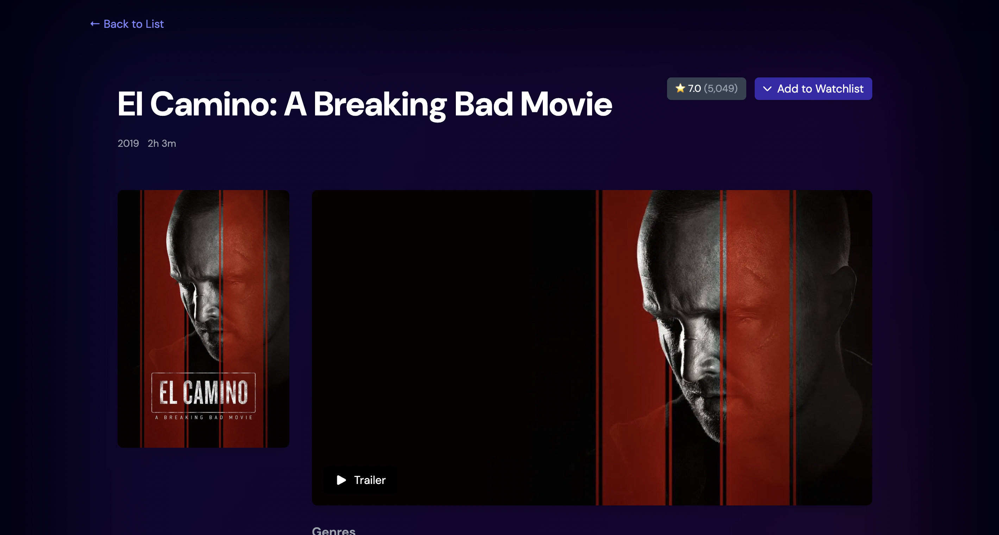
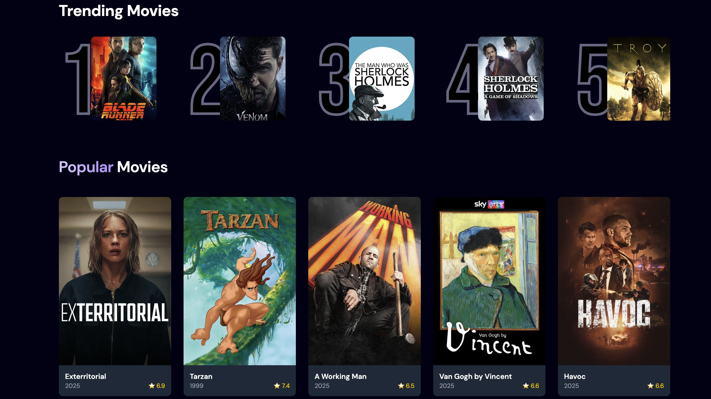
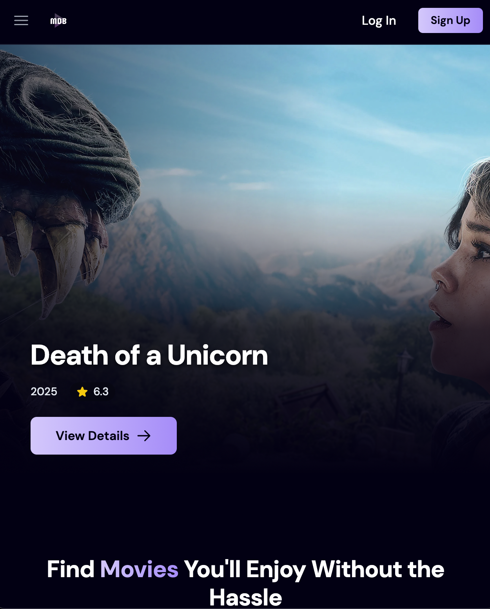
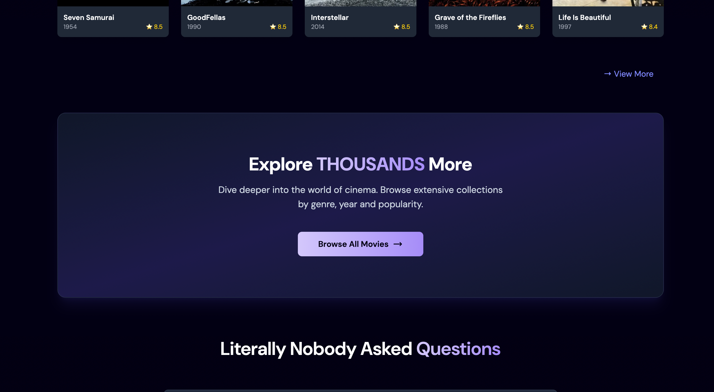

# WatchDB 🎬: Movie Discovery

<p align="center">
  " alt="WatchDBLogo" width="100%">
</p>

**WatchDB** is a modern responsive web application built with React and Tailwind CSS, designed for discovering and exploring movies (more categories to come). Making use of The Movie Database (TMDb) API and exploring backend capabilities with **Appwrite**, users can browse popular and top-rated movies, search for specific titles, view detailed information, filter through genres and interact with basic analytics features(?).

---

## Table of Contents

- [Screenshots](#-screenshots)
- [Features](#-features)
- [Tech Stack](#️-tech-stack)
- [Getting Started](#️-getting-started)
  - [Prerequisites](#prerequisites)
  - [Installation & Setup](#installation--setup)
  - [Running the App](#running-the-app)
- [API](#-api)
- [Developer Experience & Learning](#-developer-experience--learning)
- [Future Enhancements](#-future-enhancements)
- [Contact](#-contact)

---

## Screenshots

_(Replace these placeholders with actual screenshots of your application!)_

<details>
<summary>Click to view screenshots</summary>

|           Homepage (Desktop)           |             Movie Details (Desktop)             |
| :------------------------------------: | :---------------------------------------------: |
|  |  |

|                      Cards                      |                 Image Lightbox                  |
| :---------------------------------------------: | :---------------------------------------------: |
|  |  |

|            Responsive Design (Mobile)            |                    Other                     |
| :----------------------------------------------: | :------------------------------------------: |
|  |  |

</details>

---

## Features

- **Discover Movies:** Browse sections for:
  - Popular Movies (Fetched dynamically)
  - Highest-Rated Movies ("GOAT" section, filtered for relevance)
  - Trending Movies (Powered by ([Appwrite/TMDb])
- **Live Search:**
  - Live search functionality with debouncing (`react-use`) to optimize API calls.
  - Smooth scrolling to the results section upon initiating a search (click or Enter).
- **Modern Movie Details:**
  - Dedicated page for each movie (`react-router-dom`).
  - Displays poster, backdrop, title, rating, release date, runtime, overview, genres.
  - Detailed information including budget, revenue, status, languages, production companies, and tagline.
  - Display of top-billed cast members with profile pictures (or placeholders).
  - Links to the movie's official homepage and YouTube trailer (if available).
  - Visually appealing container with a subtle background glow effect.
- **Interactive Image Lightbox:**
  - Click on backdrop images in the details page to open a full-screen lightbox.
  - Navigate between images using side buttons or keyboard arrow keys (Left/Right).
  - Close the lightbox using the close button, Escape key, or clicking the background overlay.
  - Responsive button positioning (bottom on mobile, sides on desktop).
- **Responsive Design:** Fully responsive layout adapting to various screen sizes using Tailwind CSS utilities.
- **Placeholders & Loading States:** Handling of missing images (posters, backdrops, profiles) and loading states using placeholders and spinners.
- **Error Handling:** Displays of messages for API errors or missing data.

---

## 🛠️ Tech Stack

- **Frontend:**
  - [React](https://reactjs.org/) (via Vite)
  - [React Router DOM](https://reactrouter.com/) for page navigation
  - [Tailwind CSS](https://tailwindcss.com/) for styling
- **Backend / BaaS:**
  - [Appwrite](https://appwrite.io/) for database and other features.
- **State Management:** React Hooks (`useState`, `useEffect`, `useRef`)
- **API:** [The Movie Database (TMDb) API](https://developer.themoviedb.org/docs)
- **Utilities:**
  - `react-use` (specifically `useDebounce`)
  - `fetch` API (Browser built-in for API calls)
- **Deployment:** [***]

---

## ⚙️ Getting Started

Follow these instructions to get a local copy up and running for development purposes.

### Prerequisites

- [Node.js](https://nodejs.org/)
- [npm](https://www.npmjs.com/) or [yarn](https://yarnpkg.com/)

### Installation & Setup

1.  **Clone the repository:**
    ```bash
    git clone https://github.com/[YourGitHubUsername]/[YourRepoName].git
    cd [YourRepoName]
    ```
2.  **Install dependencies:**
    ```bash
    npm install
    # or
    yarn install
    ```
3.  **Set up environment variables:**
    - Create a `.env` file in the root directory of the project.
    - Obtain an API key from [The Movie Database (TMDb)](https://www.themoviedb.org/settings/api).
    - Add your TMDb API key to the `.env` file. **Make sure the variable name matches the one used in the code (prefixed with `VITE_` if using Vite):**
      ```env
      VITE_TMDB_API_KEY=YOUR_TMDB_API_KEY_HERE
      ```
    - **Important:** Add `.env` to your `.gitignore` file to prevent committing your API key!

### Running the App

- **Development Server:**

  ```bash
  npm run dev
  # or
  yarn dev
  ```

  This will usually start the app on `http://localhost:5173` (Vite's default).

- **Production Build:**
  ```bash
  npm run build
  # or
  yarn build
  ```
  This creates an optimized build in the `dist` folder.

---

## API

This project relies heavily on [The Movie Database (TMDb) API](https://developer.themoviedb.org/docs) to fetch movie data, images, credits, and more. You **must** obtain your own free API key from TMDb to run this application locally or deploy your own instance.

---

## Developer Experience & Learning

**Motivation:**
My primary goal was to honestly make something that is real-world friendly. A project that I could use on my spare time but also something that I could recommend to my friends and family. In the end, it was a great practice and learning experience to further get better at developing under related technologies.

**Key Learnings & Skills Applied:**

- **React Fundamentals:** Component composition, state management (`useState`), lifecycle methods and side effects (`useEffect`), handling user events, conditional rendering, and using refs (`useRef`) for DOM manipulation (like smooth scrolling).
- **Routing:** Implementing client-side routing for a multi-page feel using `react-router-dom`, including dynamic routes with URL parameters (`useParams`) for the movie detail pages.
- **API Integration:** Making asynchronous API calls using the `fetch` API and `async/await`, handling responses, parsing JSON data, and managing loading/error states. Understanding API documentation (TMDb).
- **Backend-as-a-Service (Appwrite):**
  - Gained experience setting up and configuring a BaaS project (Appwrite)
  - Learned about database/collection structuring and permissions within Appwrite. (KIND OF)
- **State Management Patterns:** Encountered and solved the "stale closure" problem in event handlers using functional state updates (`setState(prevState => ...)`), ensuring reliable state transitions, particularly in the image lightbox navigation.
- **Styling with Tailwind CSS:** Leveraging utility-first CSS for rapid development, creating responsive layouts using breakpoints (`md:`, `lg:`), styling components, and implementing custom effects like gradients and glows.
- **Performance Optimization:** Implementing debouncing (`useDebounce`) for the search input to limit API requests and improve performance as well as user experience.
- **User Interface/User Experience:** Designing intuitive navigation (smooth scroll, lightbox controls), providing visual feedback (loading spinners, placeholders), and ensuring accessibility (using appropriate HTML elements like `<button>`, `aria-labels`).
- **Problem Solving & Debugging:** Systematically identifying and fixing bugs related to API calls, state updates, styling conflicts, and event handling using browser developer tools and `console.log`.

**Challenges Faced:**

- Correctly configuring API requests with authorization headers.
- Managing shared state (like loading/error) across different asynchronous data fetches.
- Managing the fetch requests to receive different information.
- Implementing complex UI interactions like the responsive lightbox with keyboard navigation while avoiding common pitfalls (stale closures, event propagation).
- Achieving precise responsive layouts and styling effects with Tailwind CSS.

Overall, building this site was an invaluable learning experience, pushing me to combine various frontend technologies to create a functional and aesthetically pleasing application.

---

## 🔮 Future Enhancements

- [ ] User Authentication (Sign Up/Log In) (streaming availability &&)
- [ ] Watchlist / Favorites Functionality
- [ ] User Reviews
- [ ] <del>More Advanced Filtering & Sorting Options (by genre, year, etc.)</del>
- [ ] Several Pages with Add/Remove Functionalities (Related to Favorites)
- [ ] Integration with other APIs (e.g., streaming availability) (MAYBE)
- [ ] Add Skeleton Loaders for better perceived performance
- [ ] QOL

---

## 👋 Contact

[eren] - [https://github.com/pandeemiC]
